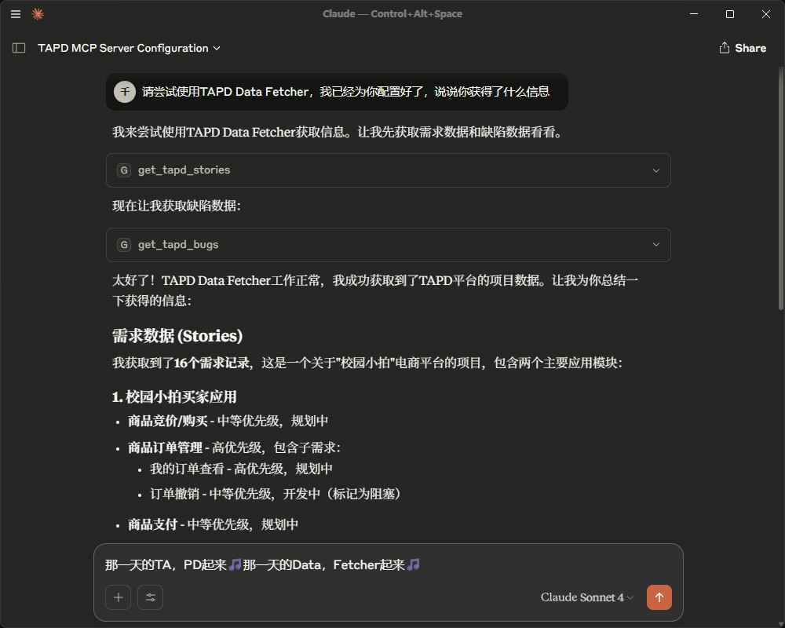

# MCP_Agent:RE 项目指南

* 对话效果预览


* 此项目于2025年6月10日由[punkpeye (Frank Fiegel)](https://github.com/punkpeye)收录于[TAPD Data Fetcher | Glama](https://glama.ai/mcp/servers/@OneCuriousLearner/MCPAgentRE)

<a href="https://glama.ai/mcp/servers/@OneCuriousLearner/MCPAgentRE">
  
</a>

## 项目背景

`MCP_Agent:RE`是一个用于从TAPD平台获取需求和缺陷数据的Python项目，旨在为AI客户端提供数据支持。

### 可用的 MCP 服务器

本项目提供了丰富的 MCP 工具集，支持 TAPD 数据的获取、处理、分析和智能摘要功能：

#### 数据获取工具

* **`get_tapd_data()`** - 从 TAPD API 获取需求和缺陷数据并保存到本地文件，返回数量统计【推荐】
  * 适用于首次获取数据或定期更新本地数据
  * 包含需求和缺陷数据的完整集成
* **`get_tapd_stories()`** - 获取 TAPD 项目需求数据，支持分页和API认证，但不保存至本地，建议仅在数据量较小时使用
* **`get_tapd_bugs()`** - 获取 TAPD 项目缺陷数据，支持状态过滤，支持分页和API认证，但不保存至本地，建议仅在数据量较小时使用

#### 向量化与搜索工具

* **`vectorize_data(chunk_size)`** - 简化版向量化工具，适用于日常使用和快速测试
* **`get_vector_info()`** - 获取简化版向量数据库状态和统计信息
* **`simple_search_data(query, top_k)`** - 基于语义相似度的智能搜索（简化版）
* **`advanced_vectorize_data(data_file_path, chunk_size)`** - 完整版向量化工具，适用于生产环境
* **`advanced_search_data(query, top_k)`** - 高级智能搜索，返回详细元数据
* **`advanced_get_vector_info()`** - 获取完整版向量数据库详细信息

#### 数据生成与分析工具

* **`generate_fake_tapd_data(n_story_A, n_story_B, n_bug_A, n_bug_B, output_path)`** - 生成模拟 TAPD 数据，用于测试和演示（使用后将会覆盖本地数据，若需要来自 API 的正确数据，请再次调用数据获取工具）
* **`generate_tapd_overview(since, until, max_total_tokens, model, endpoint, use_local_data)`** - 使用 LLM 简要生成项目概览报告与摘要，用于了解项目概况（需要在环境中配置 DeepSeek API）
  * `use_local_data=True`（默认）：使用本地数据文件进行分析，适合测试和离线分析
  * `use_local_data=False`：从TAPD API获取最新数据进行分析，适合实时数据分析

#### 示例工具

* **`example_tool(param1, param2)`** - 示例工具，展示 MCP 工具注册方式

这些工具支持从数据获取到智能分析的完整工作流，为 AI 驱动的测试管理提供强大支持。

## 项目结构

```text
MCPAgentRE\
├─knowledge_documents\      # 知识文档（Git 提交时会被忽略）
│  ├─DeepSeek API 环境变量配置指南.md
├─local_data\               # 本地数据目录，用于存储从 TAPD 获取的数据、数据库等（Git 提交时会被忽略）
│  ├─msg_from_fetcher.json      # 从 TAPD 获取的需求和缺陷数据
│  ├─data_vector.index          # 向量数据库索引文件
│  ├─data_vector.metadata.pkl   # 向量数据库元数据文件
│  └─data_vector.config.json    # 向量数据库配置文件
├─mcp_tools\                # MCP 工具目录
│  ├─data_vectorizer.py         # 高级向量化工具（完整版，适用于生产环境）
│  ├─simple_vectorizer.py       # 简化向量化工具（推荐日常或测试使用）
│  ├─context_optimizer.py        # 上下文优化器，支持智能摘要生成
│  ├─fake_tapd_gen.py           # TAPD 假数据生成器，用于测试和演示
│  └─example_tool.py            # 示例工具
├─models\                   # 模型目录
├─test\                     # 测试目录
│  ├─test_comprehensive.py      # 综合向量化功能测试
│  ├─test_vectorization.py      # 基础向量化功能测试
│  ├─test_data_vectorizer.py    # 测试完整版 data_vectorizer 工具功能
│  └─vector_quick_start.py      # 向量化功能快速启动脚本
├─.gitignore                # Git 提交时遵守的过滤规则
├─.python-version           # 记录 Python 版本（3.10）
├─提示词 - TAPD 平台 MCP 分析助手.md
├─api.txt                   # 包含 API 密钥信息，需要自行创建（Git 提交时会被忽略）
├─main.py                   # 项目入口文件，无实际作用
├─pyproject.toml            # 现代的 Python 依赖管理文件
├─README.md                 # 项目说明文档，也就是本文档
├─tapd_data_fetcher.py      # 包含从 TAPD API 获取需求和缺陷数据的逻辑
├─tapd_mcp_server.py        # MCP 服务器启动脚本，用于启动数据获取服务
└─uv.lock                   # UV 包管理器使用的锁定文件
```

## 迁移步骤

以下是将项目移植到其他 Windows 电脑的详细步骤（尚未测试 Mac 与 Linux）：

### 一、环境准备

1. **安装Python 3.10**

* 从[Python官网](https://www.python.org/downloads/windows/)下载Python 3.10.x安装包（建议3.10.11，与原环境一致）
* 安装时勾选`Add Python to PATH`（关键！否则需手动配置环境变量）
* 验证安装：终端运行`python --version`，应输出`Python 3.10.11`

2. **安装uv工具**

* 终端运行`pip install uv`（需确保pip已随Python安装）：

  ```bash
  pip install uv
  ```

* 验证安装：运行`uv --version`，应显示版本信息

### 二、项目文件迁移

1. **复制项目目录**

* 将原项目目录`D:\MiniProject\MCPAgentRE`完整复制到目标电脑（建议路径无中文/空格，如`D:\MCPAgentRE`）

### 三、依赖安装

1. **安装项目依赖**

* 终端进入项目目录：`cd D:\MCPAgentRE`（根据实际路径调整）
* 运行依赖安装命令：

  ```bash
  uv sync
  ```

  * 该命令会根据`pyproject.toml`安装所有依赖（包括MCP SDK、aiohttp等）

### 四、配置调整

1. **TAPD API配置**

* 在项目根目录下创建`api.txt`文件，复制下列文本，并替换配置为目标TAPD项目的真实值：

  ```python
  API_USER = '替换为你的TAPD API用户名'
  API_PASSWORD = '替换为你的TAPD API密码'
  WORKSPACE_ID = '替换为你的TAPD项目ID'
  ```

  * 注意：TAPD API用户名和密码需要从TAPD平台获取，具体操作请参阅[开放平台文档](https://open.tapd.cn/document/api-doc/API%E6%96%87%E6%A1%A3/%E4%BD%BF%E7%94%A8%E5%BF%85%E8%AF%BB.html)
  * WORKSPACE_ID：TAPD项目ID，可通过TAPD平台获取
  * 提交Git时会根据`.gitignore`忽略`api.txt`文件，确保敏感信息不被泄露

2. **智能摘要API配置（可选）**

如果您需要使用智能摘要功能（`generate_tapd_overview`工具），需要配置DeepSeek API密钥：

* **获取API密钥**：访问 [DeepSeek 开放平台](https://platform.deepseek.com/) 注册并获取API密钥

* **设置环境变量**（Windows PowerShell）：

  ```powershell
  # 临时设置（仅当前会话有效）
  $env:DS_KEY = "your-api-key-here"
  
  # 永久设置（推荐）
  [Environment]::SetEnvironmentVariable("DS_KEY", "your-api-key-here", "User")
  ```

* **验证配置**：

  ```powershell
  echo $env:DS_KEY
  ```

* **注意事项**：

* 设置环境变量后需重启编辑器和MCP客户端
* 如果不配置API密钥，智能摘要工具会返回错误提示，但不影响其他功能的使用
* 详细配置说明请参考 `knowledge_documents/DeepSeek API 环境变量配置指南.md`

### 五、测试运行

1. **在终端进入项目文件夹**

* 终端运行：`cd D:\MCPAgentRE`（根据实际路径调整）

#### 测试模式

1. 如果需要验证`tapd_data_fetcher.py`是否正常获取数据，请运行以下指令：

  ```bash
  uv run tapd_data_fetcher.py
  ```

* 预期输出：

  ```text
  成功加载配置: 用户=********, 工作区=********
  ===== 开始获取需求数据 =====
  需求数据获取完成，共获取X条
  ===== 开始获取缺陷数据 =====
  缺陷数据获取完成，共获取Y条
  数据已成功保存至msg_from_fetcher.json文件。
  ```

2. 如果需要验证`tapd_mcp_server.py`是否正常获取数据，请将 main 函数中的以下代码解除注释：

  ```python
  import asyncio
  
  print('===== 开始获取需求数据 =====')
  stories = asyncio.run(get_tapd_stories())
  print('===== 开始获取缺陷数据 =====')
  bugs = asyncio.run(get_tapd_bugs())

  # 打印需求数据结果
  print('===== 需求数据获取结果 =====')
  print(stories)
  # 打印缺陷数据结果
  print('===== 缺陷数据获取结果 =====')
  print(bugs)
  ```

  然后运行以下指令：

  ```bash
  uv run tapd_mcp_server.py
  ```

* 预期输出：

  ```text
  ===== 开始获取需求数据 =====
  需求数据获取完成，共获取X条
  ===== 开始获取缺陷数据 =====
  缺陷数据获取完成，共获取Y条
  ===== 需求数据获取结果 =====
  [具体JSON数据...]
  ===== 缺陷数据获取结果 =====
  [具体JSON数据...]
  ```

3. **快速验证向量化功能**（推荐）：

  ```bash
  uv run test\vector_quick_start.py
  ```

* 该脚本会自动运行数据获取、向量化和搜索功能，验证整体流程是否正常
* 首次使用时需要连接 VPN 以下载模型
* 预期输出：显示向量化成功和搜索演示结果

4. **详细向量化功能测试**：

  ```bash
  # 基础向量化测试
  uv run test\test_vectorization.py
  
  # 综合功能测试
  uv run test\test_comprehensive.py

  # 完整版工具测试
  uv run test\test_data_vectorizer.py
  ```

* 首次使用时需要连接 VPN 以下载模型
* 这些测试脚本位于`test`目录下，会验证所有向量化功能

5. **上下文优化器和假数据生成测试**：

  ```bash
  # 生成模拟TAPD数据（用于测试）
  uv run mcp_tools\fake_tapd_gen.py
  
  # 使用上下文优化器生成数据概览（离线模式）
  uv run mcp_tools\context_optimizer.py -f local_data\msg_from_fetcher.json --offline --debug
  
  # 生成详细摘要（需要配置API密钥）
  uv run mcp_tools\context_optimizer.py -f local_data\msg_from_fetcher.json --debug
  ```

* **环境变量配置（在线模式）**：为使用上下文优化器的在线LLM功能，需要设置以下环境变量：

  ```bash
  set DS_KEY=your_deepseek_api_key        # DeepSeek API密钥
  set DS_EP=https://api.deepseek.com/v1   # API端点URL（可选，默认为DeepSeek）
  set DS_MODEL=deepseek-reasoner          # 模型名称（可选，默认为deepseek-reasoner）
  ```

* 上下文优化器支持离线模式（`--offline`参数）和在线智能摘要生成
* 假数据生成器用于测试和演示，生成符合TAPD格式的模拟数据

#### 正常模式

1. 确保`tapd_mcp_server.py`的 main 函数中的下列代码已注释或删除

  ```python
  # import asyncio
  
  # print('===== 开始获取需求数据 =====')
  # stories = asyncio.run(get_tapd_stories())
  # print('===== 开始获取缺陷数据 =====')
  # bugs = asyncio.run(get_tapd_bugs())

  # # 打印需求数据结果
  # print('===== 需求数据获取结果 =====')
  # print(stories)
  # # 打印缺陷数据结果
  # print('===== 缺陷数据获取结果 =====')
  # print(bugs)
  ```

2. 运行MCP服务器（此操作将由AI客户端根据配置文件自动执行，无需手动操作）：

  ```bash
  uv run tapd_mcp_server.py
  ```

### 六、常见问题排查

* **依赖缺失**：若提示`ModuleNotFoundError`，检查是否执行`uv add`命令，或尝试`uv add <缺失模块名>`
* **API连接失败**：确认`API_USER` / `API_PASSWORD` / `WORKSPACE_ID`正确，且TAPD账号有对应项目的读取权限
* **Python版本不匹配**：确保目标电脑Python版本为3.10.x（通过`python --version`验证）

---

# 如何将项目连接到AI客户端

## 前提条件

* 已在本地电脑上完成项目的迁移和验证
* 已安装并运行MCP服务器
* 已在本地电脑上安装并运行AI客户端（以Claude Desktop为例）

## 连接步骤

1. **打开Claude Desktop**

* 启动Claude Desktop客户端

2. **配置MCP服务器**

* 使用快捷键`Ctrl + ,`打开设置页面（或者点击左上角菜单图标 - File - Settings）
* 选择`Developer`选项卡
* 点击`Edit Config`按钮，将会弹出文件资源管理器
* 编辑高亮提示的`claude_desktop_config.json`文件，添加以下内容（注意层级关系）：

  ```json
  {
    "mcpServers": {
      "tapd_mcp_server": {
        "command": "uv",
        "args": [
          "--directory",
          "D:\\MiniProject\\MCPAgentRE",
          "run",
          "tapd_mcp_server.py"
        ]
      }
    }
  }
  ```

  * 注意：
    * `command`字段指定了运行MCP服务器的命令（通常为`uv`）
    * `args`字段指定了运行MCP服务器的参数，包括项目目录（`--directory`）和运行的脚本文件（`run tapd_mcp_server.py`）
    * 确保`--directory`指向的是MCP服务器所在的目录，即`D:\MiniProject\MCPAgentRE`（请按照实际目录修改）
* 保存并关闭文件

## 测试连接

* 点击Claude Desktop界面左上角的`+`按钮，选择`New Chat`
* 在新的聊天窗口中，输入以下内容测试基础功能：

  ```text
  请使用tapd_mcp_server插件获取TAPD项目的需求和缺陷数据
  ```

* 点击发送按钮，等待MCP服务器返回数据
* 检查返回的数据是否符合预期，包括需求和缺陷的数量和内容

## 注意事项

* 确保MCP服务器的路径和参数配置正确
* 如果MCP服务器运行时出现错误，检查MCP服务器的日志文件（通常位于`%APPDATA%\Claude\logs`）以获取更多信息
* 如果AI客户端无法识别MCP插件，可能需要重新安装或更新AI客户端
* 您可以运行以下命令列出最近的日志并跟踪任何新日志（在 Windows 上，它只会显示最近的日志）：

  ```bash
  type "%APPDATA%\Claude\logs\mcp*.log"
  ```

# 扩展MCP服务器功能

为了让项目目录结构更清晰，建议将MCP工具函数放在`mcp_tools`文件夹中。下面是一个添加新工具函数的示例方法。

## 添加新工具函数

1. **创建工具函数文件**

* 在`mcp_tools`文件夹中创建新的Python文件（如`new_tool.py`）
* 编写异步函数，示例模板：

  ```python
  async def new_function(param1: str, param2: int) -> dict:
      """
      新工具函数说明
      
      参数:
          param1: 参数说明
          param2: 参数说明
          
      返回:
          返回数据结构说明
      """
      # 函数实现
      return {"result": "处理结果"}
  ```

2. **注册工具到服务器**

* 在`tapd_mcp_server.py`中添加：
  * 导入语句：`from mcp_tools.new_tool import new_function`
  * 使用`@mcp.tool()`装饰器注册函数：

    ```python
    @mcp.tool()
    async def new_tool(param1: str, param2: int) -> dict:
        """
        工具功能详细说明
        
        参数:
            param1 (str): 参数详细说明
            param2 (int): 参数详细说明
            
        返回:
            dict: 返回数据结构详细说明
        """
        return await new_function(param1, param2)
    ```

3. **描述文档最佳实践**

* 为AI客户端添加清晰的文档：
  * 函数级文档：使用详细的中文说明，包括参数类型和返回值结构
  * 参数说明：明确每个参数的数据类型和预期用途
  * 返回说明：详细描述返回字典的每个字段
  * 示例：提供调用示例和预期输出

---

# 相关文档或网址

* [TAPD帮助文档](https://www.tapd.cn/help/show#1120003271001000137)
* [TAPD开放平台文档](https://open.tapd.cn/document/api-doc/API%E6%96%87%E6%A1%A3/%E4%BD%BF%E7%94%A8%E5%BF%85%E8%AF%BB.html)
* [MCP中文站](https://mcpcn.com/docs/introduction/)
* [Model Context Protocol](https://modelcontextprotocol.io/introduction)
